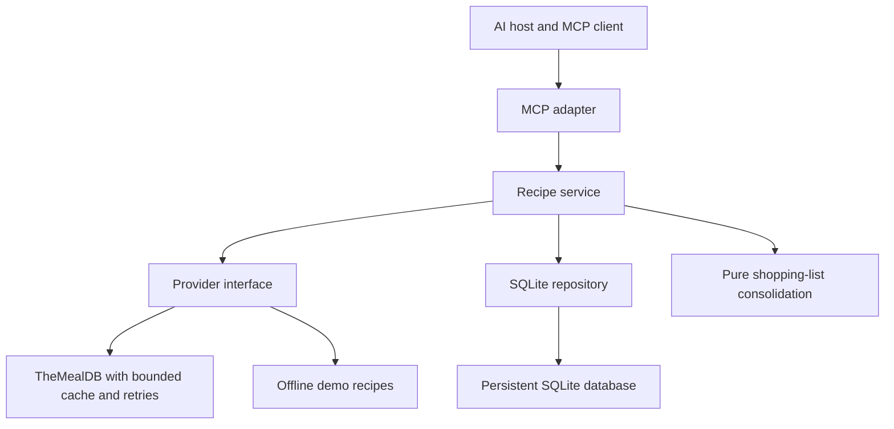

# Recipe MCP

A recipe research and meal planning server for MCP-compatible AI hosts. Search for dishes, inspect recipes, save complete meal plans with repeatable writes, and generate consolidated shopping lists with traceable quantities. Run entirely offline for a portfolio demonstration or connect to TheMealDB for live recipes.

This is a from-scratch rebuild of the recipe capstone in Paulo Dichone's **Model Context Protocol Unlocked** course. The public course source and syllabus were inspected; the paid videos were not viewed. See [course synthesis](docs/COURSE_SYNTHESIS.md), [interview prep](docs/INTERVIEW_PREP.md) and [verification evidence](docs/VERIFICATION.md).

## Quick start

Requires Python 3.12 or newer (3.12–3.14 supported) and [uv](https://docs.astral.sh/uv/). From the extracted project directory:

```bash
uv sync --locked
uv run python scripts/demo.py
```

The demo starts a real in-process MCP client, discovers capabilities, searches offline recipes, saves a plan, repeats the request with the same idempotency key, and checks the persisted resource. It uses a temporary database, makes no external API calls, and needs no model API key.

Run a server for a local desktop host:

```bash
uv run recipe-mcp --demo
```

This starts **stdio**, so waiting silently is normal. An MCP client must send protocol messages; this is not an interactive command prompt. Live mode is the default: omit `--demo`.

## Connect a host

Use the executable path returned by `command -v uv` (or `where uv` on Windows) and replace the project and database paths with absolute paths on your computer. Example Claude Desktop MCP server entry:

```json
{
  "mcpServers": {
    "recipes": {
      "command": "/absolute/path/to/uv",
      "args": ["--directory", "/absolute/path/to/recipe-mcp", "run", "--locked", "recipe-mcp", "--demo"],
      "env": {"RECIPE_DATABASE_PATH": "/absolute/path/to/recipe-mcp/data/demo.sqlite3"}
    }
  }
}
```

Remove `--demo` for live recipes. Keep separate database paths for live and demo modes. In VS Code, use the same command/args/env under `servers.recipes` in `.vscode/mcp.json` and add `"type": "stdio"`. Restart/reload the host after editing its configuration. Host UI labels and configuration locations may vary; the protocol tests verify the server, not a particular installed desktop application.

Try: “Find orzo recipes, show their ingredients, and propose a plan called Weeknight dinners. Ask before saving it.” The host controls model access and user confirmation. The server neither runs an LLM nor enforces the host's approval UI.

After saving a plan, try: “Use `generate_shopping_list` for the saved plan. Show the consolidated quantities, ingredients that need review, and any unit warnings. Keep unresolved measurements visible.” The tool reads local saved data without changing the plan or contacting the recipe API. See the [shopping-list guide](docs/SHOPPING_LIST.md) for its quantity rules and limitations.

## Architecture



The adapter owns MCP schemas and errors. The service coordinates use cases. Providers normalize external data; the repository owns transactions. Async HTTP handles network waits and whole SQLite operations run in worker threads. All acquisition paths persist full details. Recipe IDs are unique; meal plans snapshot summaries so later recipe refreshes do not alter saved plan names or categories.

Shopping lists use a consistent database read of the saved plan and its current saved recipes, followed by pure, deterministic quantity consolidation. Ingredients are not historical plan snapshots: the response explicitly identifies `ingredient_source` as `current_saved_recipes`. Refreshing a saved recipe can therefore change a later shopping list without changing the plan's summary snapshot. Existing databases and plans remain compatible; this feature does not change schema version 1.

## Capabilities

| Tool | Behavior |
| --- | --- |
| `search_recipes(dish_name, max_results=5)` | Dish-name search; returns IDs and summaries and saves full details. |
| `search_by_first_letter(letter, max_results=5)` | One ASCII letter; saves complete results. |
| `get_recipe_details(recipe_id)` | Reads saved data, otherwise fetches and saves by ID. |
| `get_random_recipe()` | Fetches and saves one recipe. |
| `create_meal_plan(recipe_ids, plan_name, idempotency_key)` | Validates all IDs and atomically saves one complete plan. |
| `get_meal_plan(plan_id)` | Retrieves the immutable saved summary snapshot. |
| `generate_shopping_list(plan_id)` | Reads a saved plan and its locally stored recipes; combines compatible quantities and returns provenance, unresolved measurements, and review warnings. |

Search limits are 1–25. Names are limited to 100 characters. Plans accept 1–30 IDs, deduplicated in order. A reused idempotency key with the same normalized name and ordered IDs returns the same plan; changed content produces `idempotency_conflict`. Without a key, every call creates a new plan. Unknown IDs cause the entire **plan** to fail; recipes fetched successfully along the way may remain in the cache.

Shopping quantities apply once per unique recipe, using its original ingredient quantities; there is no serving scaling. Metric mass and volume use exact conversions within their own families; pounds and ounces share a separate mass family. Uncertain measurements remain visible, different units remain separate, and `requires_review` is true whenever there are unresolved entries or warnings. No LLM calculates these quantities. See [the supported units and examples](docs/SHOPPING_LIST.md).

Resources: `recipes://cuisines`, `recipes://stats`, `recipes://meal-plans` (latest 50), `recipes://cuisine/{cuisine}` (up to 100), and `recipes://recipe/{recipe_id}`. Resources never fetch upstream or create state. Unlike the original course's collection URI, the cuisine URI filters actual provider cuisine labels.

Five prompts preserve the course's recipe search, meal planning, cooking lesson, ingredient exploration, and cultural cuisine workflows. They distinguish sourced recipe facts from estimates. Dish-name search is not cuisine or ingredient filtering. Serving counts, nutrition, cost, cooking times and allergy safety are not reliably available from the provider.

## Portfolio improvements

1. **Resilient provider access:** pooled asynchronous HTTP, finite timeouts, bounded transient retries with backoff, capped Retry-After handling, TTL/LRU cache, and duplicate concurrent lookup suppression. Random selection is never cached. Error messages use stable codes and do not expose upstream credentials.
2. **Transactional and testable meal planning:** SQLite constraints and transactions, UUID plan identities, persistent idempotency keys, complete-plan validation, and automated domain/provider/protocol/HTTP/stdio tests.
3. **Deterministic shopping lists:** exact rational arithmetic, conservative ingredient matching and unit conversion, source attribution for every ingredient line, and explicit review of ambiguous measurements. Missing recipe data fails the operation instead of returning an apparently complete list. See [shopping-list design and interview questions](docs/SHOPPING_LIST.md).

The current stable official MCP SDK is pinned through `uv.lock` (2.2.0 at implementation time, September 19, 2026). The course's `FastMCP` import from SDK v1 was migrated to `MCPServer`, transport options moved to the run/app boundary, and clients use v2 snake_case result attributes. The external recipe adapter uses `httpx`; the SDK independently uses `httpx2` for MCP transport. Neither client is passed to the other library.

## HTTP and configuration

```bash
uv run recipe-mcp --demo --transport http
```

Endpoint: `http://127.0.0.1:8000/mcp`. Liveness: `/healthz`. Readiness: `/readyz` checks database readability. Readiness does not prove upstream availability or available disk space for writes.

Copy `.env.example` to `.env` for your local settings. Environment variables override `.env`; explicit CLI arguments override both. `PORT` is accepted for managed hosting.

| Variable | Default | Purpose |
| --- | --- | --- |
| `RECIPE_MODE` | `live` | `live` or `demo`. |
| `RECIPE_DATABASE_PATH` | `data/recipes.sqlite3` | Durable database path; use different files per mode. |
| `RECIPE_HOST` / `RECIPE_PORT` | `127.0.0.1` / `8000` | HTTP bind. |
| `RECIPE_AUTH_TOKEN` | unset | 32–256 visible ASCII characters; required outside loopback. |
| `RECIPE_ALLOWED_HOSTS` | localhost and loopback | JSON array of exact allowed hosts; `:*` permits ports. |
| `RECIPE_ALLOWED_ORIGINS` | localhost and loopback | JSON array of trusted origins; no global wildcard. |
| `RECIPE_API_KEY` | `1` | TheMealDB development/educational key. |
| `RECIPE_CACHE_TTL` / `RECIPE_CACHE_SIZE` | `300` / `128` | Cache seconds / maximum entries. |
| `RECIPE_REQUEST_TIMEOUT` / `RECIPE_RETRIES` | `10` / `2` | Per-attempt timeout / additional attempts. |

Live recipe details already saved in SQLite are durable snapshots and do **not** expire when the provider's in-memory cache does. Searching or random retrieval may refresh them. Plan snapshots remain unchanged. This avoids claiming TTL freshness for all saved data.

HTTP access uses one shared bearer token for a **private, single-tenant deployment**, not full MCP OAuth. Use HTTPS at the edge and a client that can send the Authorization header. It does not provide per-user permissions or tenant isolation, and some hosted MCP clients require OAuth instead. Host/Origin checks, a 64 KiB request limit, and a shared 120-request-per-minute process quota apply to protocol traffic. Health routes intentionally reveal only minimal status and do not require a token. The quota resets on restart and is not a distributed rate limiter.

TheMealDB documents key `1` for development/education and separate requirements for public app-store releases. Review [its current API guidance](https://www.themealdb.com/api.php) for your intended release and configure your own key as appropriate. Recipe/image content remains attributable to TheMealDB and its linked sources. Demo recipes are original illustrative fixtures.

## Verification

```bash
uv run pytest --cov=recipe_mcp --cov-report=term-missing
uv run ruff check .
uv run ruff format --check .
uv run mypy
```

Tests use temporary SQLite files and mocked upstream HTTP; they do not require a live recipe API. Real MCP client exchanges cover discovery, inputs, structured results, resources and prompts. HTTP-level tests cover authentication and transport defenses. A subprocess test exercises stdio framing.

Run the optional live smoke test separately:

```bash
uv run python scripts/live_smoke.py
```

## Deployment and operations

See [operations](docs/OPERATIONS.md). The supplied Dockerfile, Compose configuration, and Render blueprint target **one replica with a persistent local disk**. Docker and cloud execution require separate environment verification; see the recorded verification report. TLS terminates at the host's reverse proxy. No deployment is performed by setup scripts.

The project intentionally avoids a separate frontend: the MCP host supplies the user interface. A public multi-user service needs OAuth, authorization on stored records, and a database/operational design appropriate to the workload. Horizontal scaling is not supported by this SQLite deployment.

## Sources and attribution

- [Original course source](https://github.com/PacktPublishing/Model-Context-Protocol-Unlocked-From-Fundamentals-to-Advanced-Customization/tree/12ae65cf869c1105aa102b917f19a95fbaee87d2)
- [Official SDK migration guide](https://py.sdk.modelcontextprotocol.io/migration/)
- [TheMealDB API](https://www.themealdb.com/api.php)

MIT-licensed application code. See `THIRD_PARTY_NOTICES.md` for the course attribution and external data distinction.
